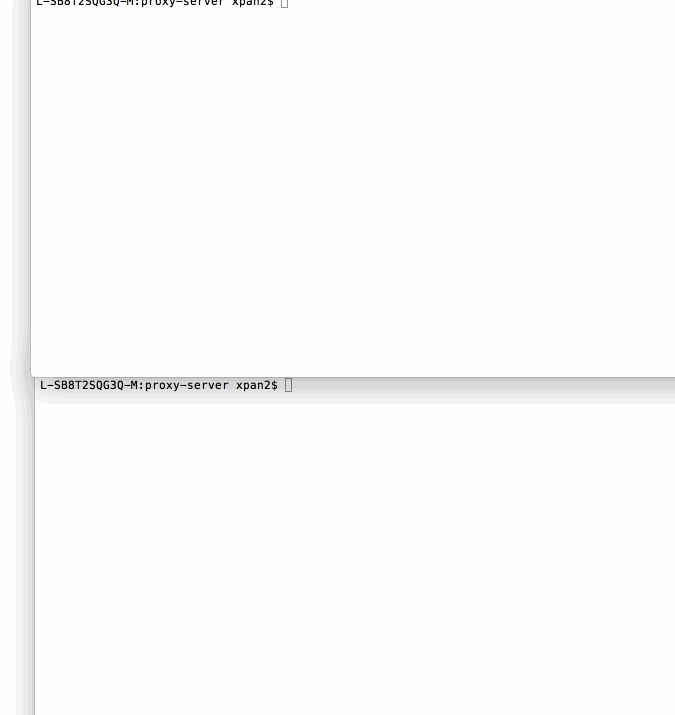

# proxy-server
This is the Pre-work for the node.js training. In the project, I built a echo server and proxy server.

Completed:

* [] Required: Successfully echo requests made to the echo server
* [] Required: Successfully proxy requests made to the proxy server
* [] Required: Include a CLI so the destination server can be configurable via the `--host`, `--port`, `--url` arguments or via the `x-destination-url` header
* [] Required: Log request to stdout or save it properly to a file when the log argument is given

Walkthrough Gif:




## Starting the Server

```bash
npm start
```

## Features

### Echo Server:

```bash
L-SB8T2SQG3Q-M:proxy-server xpan2$ curl -v http://127.0.0.1:8000 -d "hello world" -H "x-asdf: foo"
* Rebuilt URL to: http://127.0.0.1:8000/
* Hostname was NOT found in DNS cache
*   Trying 127.0.0.1...
* Connected to 127.0.0.1 (127.0.0.1) port 8000 (#0)
> POST / HTTP/1.1
> User-Agent: curl/7.37.1
> Host: 127.0.0.1:8000
> Accept: */*
> x-asdf: foo
> Content-Length: 11
> Content-Type: application/x-www-form-urlencoded
>
* upload completely sent off: 11 out of 11 bytes
< HTTP/1.1 200 OK
< user-agent: curl/7.37.1
< host: 127.0.0.1:8000
< accept: */*
< x-asdf: foo
< content-length: 11
< content-type: application/x-www-form-urlencoded
< Date: Sun, 23 Aug 2015 22:40:37 GMT
< Connection: keep-alive
<
* Connection #0 to host 127.0.0.1 left intact
hello worldL-SB8T2SQG3Q-M:proxy-server xpan2$
```

### Proxy Server:

Port 8001 will proxy to the echo server on port 8000.

```bash
L-SB8T2SQG3Q-M:proxy-server xpan2$ curl -v http://127.0.0.1:8001/asdf -d "hello jean"
* Hostname was NOT found in DNS cache
*   Trying 127.0.0.1...
* Connected to 127.0.0.1 (127.0.0.1) port 8001 (#0)
> POST /asdf HTTP/1.1
> User-Agent: curl/7.37.1
> Host: 127.0.0.1:8001
> Accept: */*
> Content-Length: 10
> Content-Type: application/x-www-form-urlencoded
>
* upload completely sent off: 10 out of 10 bytes
< HTTP/1.1 200 OK
< user-agent: curl/7.37.1
< host: 127.0.0.1:8001
< accept: */*
< content-length: 10
< content-type: application/x-www-form-urlencoded
< connection: close
< date: Sun, 23 Aug 2015 22:41:51 GMT
<
* Closing connection 0
hello jeanL-SB8T2SQG3Q-M:proxy-server xpan2$
```

### Configuration:

#### CLI Arguments:

The following CLI arguments are supported:

##### `--host`

The host of the destination server. Defaults to `127.0.0.1`.

##### `--port`

The port of the destination server. Defaults to `80` or `8000` when a host is not specified.

##### `--url`

A single url that overrides the above. E.g., `http://www.google.com`

##### `--log`

Specify a file path to redirect logging to.

#### Headers

The follow http header(s) are supported:

##### `x-destination-url`

Specify the destination url on a per request basis. Overrides and follows the same format as the `--url` argument.